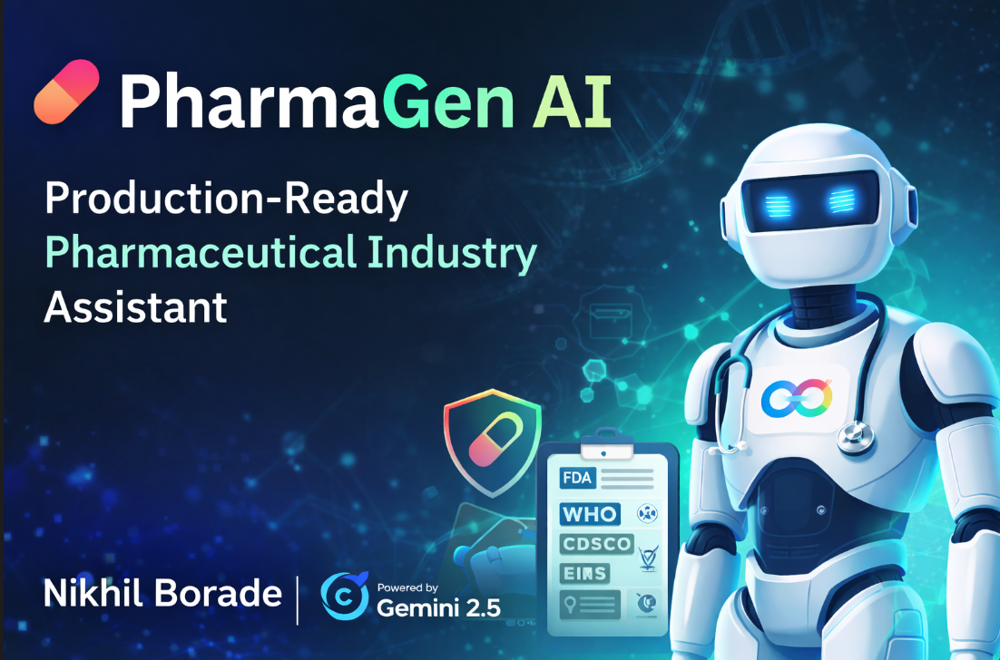
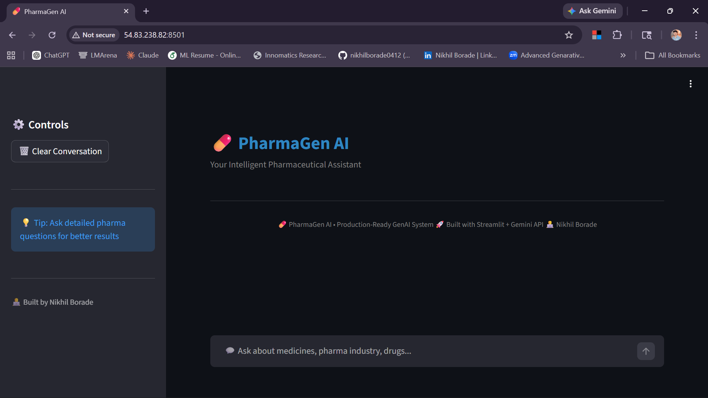

# 💊 PharmaGen AI

### Production-Ready Pharmaceutical Industry Assistant (Powered by Nikhil Borade)

PharmaGen AI is a **domain-specific, production-grade Generative AI chatbot** designed to assist users with pharmaceutical industry knowledge.
It leverages **Google Gemini models** and follows a **modular, scalable architecture** suitable for real-world deployment.

---

## 🔗Live Demo of ChatBot
[Live Demo](http://54.83.238.82:8501/)

---

## 🚀 Application Preview


---
 
## 🚀 Project Overview

PharmaGen AI simulates a **real-world GenAI production system**, integrating:

* ✅ Google Gemini API (latest supported models)
* ✅ Multi-turn conversational memory
* ✅ Advanced prompt engineering
* ✅ Streamlit-based interactive UI
* ✅ Secure environment variable management
* ✅ Modular and maintainable architecture
* ✅ Cloud deployment readiness (AWS EC2, etc.)

This chatbot is **strictly restricted to pharmaceutical domain queries**, ensuring focused and relevant responses.

---

## 🏗 System Architecture

```
User (Browser)
   ↓
Streamlit UI
   ↓
Application Layer (Python Backend)
   ↓
Conversation Memory Manager
   ↓
Prompt Engineering Layer
   ↓
Gemini Model (Flash / Latest Supported)
   ↓
AI Response
```

---

## 🧠 Core Features

### 🔹 Domain-Specific Intelligence

PharmaGen AI is trained to respond only within pharmaceutical topics such as:

* Drug Development Lifecycle
* GMP (Good Manufacturing Practices)
* GLP (Good Laboratory Practices)
* Pharmaceutical Manufacturing
* Quality Assurance (QA) & Quality Control (QC)
* Regulatory Authorities (FDA, WHO, CDSCO, EMA)
* Pharmacopeia Standards

---

### 🔹 Multi-Turn Conversation Memory

Maintains session-based context for more accurate and meaningful responses.

---

### 🔹 Intelligent Model Handling

* Uses **available Gemini models dynamically**
* Includes **retry mechanism**
* Handles API failures gracefully

---

### 🔹 Secure API Management

* API keys stored securely using `.env`
* No hardcoded credentials
* Safe for deployment

---

### 🔹 Production-Level Code Structure

```
pharmagen-ai/
│
├── app.py
├── chatbot/
│   ├── gemini_client.py
│   ├── memory_manager.py
│   ├── prompt_builder.py
│
├── test.py
├── .env
├── requirements.txt
└── README.md
```

---

## ⚙️ Tech Stack

* Python 3.10+
* Streamlit
* Google GenAI SDK
* Gemini Models (Flash / Latest Supported)
* python-dotenv

---

## 🔐 Environment Setup

### 1️⃣ Clone Repository

```bash
git clone <your-repo-url>
cd pharmagen-ai
```

---

### 2️⃣ Create Virtual Environment

```bash
python -m venv myenv
```

Activate:

**Windows**

```bash
myenv\Scripts\activate
```

**Mac/Linux**

```bash
source myenv/bin/activate
```

---

### 3️⃣ Install Dependencies

```bash
pip install -r requirements.txt
```

If missing:

```bash
pip install streamlit google-genai python-dotenv
```

---

## ▶️ Run Application

```bash
streamlit run app.py
```

Access:

```
http://localhost:8501
```

---

## 🧪 Example Queries

* What is GMP in pharmaceutical manufacturing?
* Explain drug development lifecycle.
* What are the functions of FDA?
* What is Vitamin B12 used for?
* Explain QA vs QC in pharma.

---

## ⚠️ Limitations

* ❌ No medical diagnosis
* ❌ No treatment recommendations
* ✅ Restricted to pharmaceutical industry knowledge only

---

## ☁️ Deployment (Cloud Ready)

Supported platforms:

* AWS EC2
* Render
* Railway
* Azure VM
* Google Cloud VM

Run on server:

```bash
streamlit run app.py --server.port 8501 --server.address 0.0.0.0
```

---

## 🛡 Security Practices

* Environment-based API key management
* `.gitignore` configured
* No exposed credentials
* Domain-restricted prompts

---

## 📌 Future Enhancements

* 🔹 Database-backed persistent memory
* 🔹 User authentication system
* 🔹 Role-based access control
* 🔹 Logging & monitoring (observability)
* 🔹 CI/CD pipeline integration
* 🔹 Docker containerization
* 🔹 Custom frontend (React/Next.js)

---

## 👨‍💻 Author

**Nikhil Borade**
Computer Science Graduate | AI & Data Science Enthusiast

---

## 📄 License

This project is intended for **educational and demonstration purposes**.


